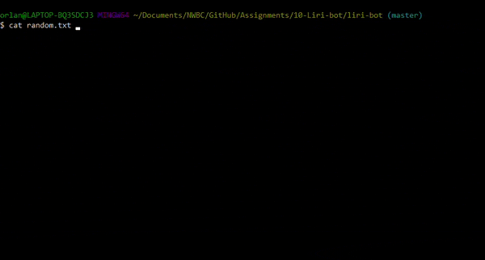

# liri-bot
LIRI is a Language Interpretation and Recognition Interface. LIRI will be a command line node app that takes in parameters and gives you back data.

## Overview
In this project we focused on using **Node.js** in the command line and taking parameters (`process.argv`)to call a function and display output to the console.
* When running Node with following strings, Node takes the strings as an array, with spaces as the separator.
    * The first item in the array is the Node.exe path
    * Second item is the current directory
* The LIRI app takes the third item of the array for the command, while the rest are used as arguments for API calls.

## Software used
* [NODE.JS](https://nodejs.org/en/) - a JavaScript runtime built on Chrome's V8 JavaScript engine.
* [Axios](https://www.npmjs.com/package/axios)
    * Installation: `node install axios`
    * Used for grabbing data from: 
        * [OMDB API](http://www.omdbapi.com/)
        * [Bands In Town API](http://www.artists.bandsintown.com/bandsintown-api)
* [Node-Spotify-API](https://www.npmjs.com/package/node-spotify-api)
    * Installation: `npm install node-spotify-api`
* [Moment](https://www.npmjs.com/package/moment)
    * Moment.js module is used for formatting time.
    * Installation: `npm install moment`
* [Dotenv](https://www.npmjs.com/package/dotenv)
    * A zero-dependency module for loading environment variables from `.env` into `process.env`.
    * Installation: `npm install dotenv`
* [FS module](https://nodejs.org/api/fs.html)
    * *"The `fs` module provides an API for interacting with the file system in a manner closely modeled around standard POSIX functions."* ([link](https://nodejs.org/api/fs.html#fs_file_system))

## The 'getMyStuff' object
The `getMyStuff` object contains multiple methods for the LIRI app to determine which command was entered and then calls that specific method to obtain and display specific information.
* `processArgs ` method 
    * gets an array from `[process.argv](https://nodejs.org/api/process.html#process_process_argv)`, which is a *"property that returns an array containing the command line arguments passed when the Node.js process was launched."*
* `checkCommand` method
    * Uses the `switch/case` statement checks if the command argument matches an existing method and calls that method.
* `concertThis` method.
* `spotifyThis` method.
* `movieThis` method.
* `doWhatItSays` method.
* `addToFile` method.

## Running the program
LIRI is run in the command line.

* `node liri.js concert-this <artist/band name here>` runs the `concertThis` method along with the name of the artist or band as an argument. It gets info from the Bands In Town API using Axios and displays multiple show events.
    * If no argument (Artist or Band) is entered, it will search using "Rick Astley" as a default value
    * Save command and argument to `addToFile` method.
    * Screenshot:
        * 

* `node liri.js spotify-this-song <song name here>` runs the `spotifyThis` method.
    * If a song is entered, it will send it as a query to the Spotify API and returns the artist's name, song name, preview link, and album.
    * If no argument is given, "Never gonna give you up" will be used as a default argument.
    * Save command and argument to `addToFile` method.
    * Screenshot:
        * 
        

* `node liri.js movie-this <movie name here>` runs the `movieThis` method using Axios and OMDB API.
    * If a movie is entered, it returns the movie title, year, IMDB Rating, RT rating, country, language, plot, and actors.
    * If no movie is entered, a default value of "Mr Nobody" is used.
    * Save command and argument to `addToFile` method.
    * Screenshot:
        * 

* `node liri.js do-what-it-says` runs the `doWhatItSays` method using the FS module to get a string from the `random.txt` file.
    * The "," in the string will be used as a delimiter using `.split(",") and saves the string as two items in an array.
    * The first item is used as the command and the second item is the query argument.
    * The command and query argument are passed to the `checkCommand` method which then calls the appropriate method.
    * Save command and argument to `addToFile` method.
    * Screenshot:
        * 

* The`addToFile` method uses the `FS` module to append a string to the `log.txt` file.
    * Moment.js is used to getthe current time and format it as `[YYYY/DD/MM hh:mm:ss]`.
    * Here's the following format of the string
        * `[YYYY/DD/MM hh:mm:ss] <command-name> <argument>`
    * Screenshot
        * 

## Screenshots

### Concert This (Bands In Town API)

### Spotify This Song (Spotify API)

### Movie This (OMDB API)

:sparkles: :camel: :boom: